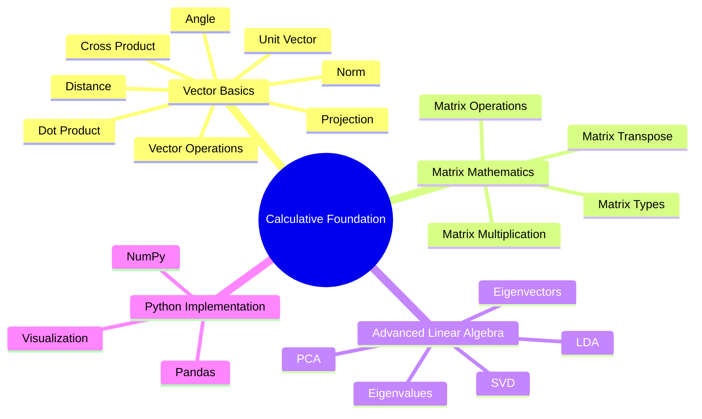
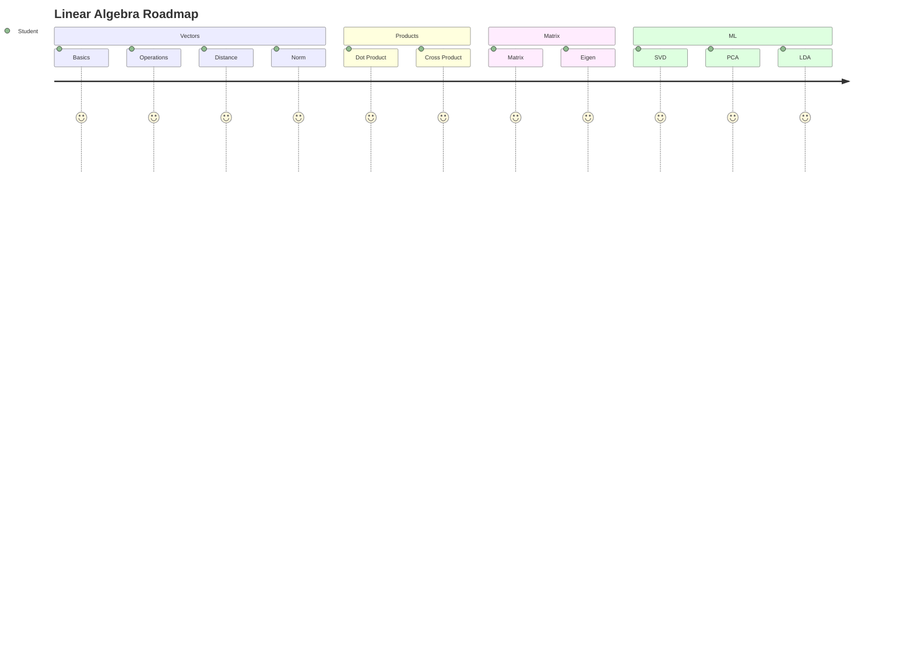

<div align="center">

# 📐 Calculative Foundation

### *Master Linear Algebra & Matrix Mathematics through Theory, Visualization, and Python Implementation*


<br>


<br><br>

> **A complete educational project that bridges Mathematical Theory with Practical Python Implementation.**

> Learn the foundations of **Linear Algebra**, understand the mathematics behind **Machine Learning**, and implement every concept using Python.

---

### 🚀 Quick Access

<a href="#">

</a>

<a href="#">

</a>

<a href="#">

</a>

<a href="#">

</a>

</div>

---

# 🌟 Project Overview

Calculative Foundation is a complete learning project designed for students, beginners, and aspiring Data Scientists who want to understand the mathematical concepts behind Machine Learning.

Instead of only learning formulas, this project explains **why each concept matters**, demonstrates **real-world applications**, and provides **Python implementations** for every topic.

This project combines **Theory + Visualization + Coding + Practical Examples** into one structured repository.

---

# 🎯 Objectives

- 📚 Learn Linear Algebra from beginner to intermediate level
- 🧮 Understand mathematical intuition behind Machine Learning
- 🐍 Implement every concept using Python
- 📊 Visualize mathematical operations
- 💡 Apply concepts on a real-world student performance dataset
- 🚀 Build a portfolio-ready educational project

---

# ✨ Project Highlights

<table>

<tr>

<td align="center" width="33%">

## 📖 Theory

Comprehensive explanations with
definitions,
formulas,
examples,
applications,
and mathematical intuition.

</td>

<td align="center" width="33%">

## 💻 Practical

Hands-on Python implementation
using NumPy,
Pandas,
and Scikit-Learn.

</td>

<td align="center" width="33%">

## 📈 Visualization

Understand every concept visually
through graphs,
matrix operations,
and geometric interpretation.

</td>

</tr>

</table>

---

# 🚀 Key Features

| Feature | Status |
|----------|:------:|
| 📖 Complete Theory Notes | ✅ |
| 🧮 Linear Algebra Concepts | ✅ |
| 🐍 Python Implementation | ✅ |
| 📊 Real Dataset | ✅ |
| 📈 Mathematical Visualization | ✅ |
| 📚 Beginner Friendly | ✅ |
| 🎯 Step-by-Step Learning | ✅ |
| 💼 Portfolio Ready | ✅ |
| 📓 Jupyter Notebook | ✅ |

---

# 📚 Topics Covered

```text
Vectors
│
├── Vector Operations
├── Distance Between Vectors
├── Vector Norms
├── Unit Vector
├── Dot Product
├── Cross Product
├── Angle Between Vectors
├── Vector Projection
│
Matrices
│
├── Matrix Types
├── Matrix Operations
├── Matrix Multiplication
├── Matrix Transpose
│
Advanced Concepts
│
├── Eigenvalues
├── Eigenvectors
├── Singular Value Decomposition (SVD)
├── Principal Component Analysis (PCA)
└── Linear Discriminant Analysis (LDA)
```

---

# 📑 Table of Contents

- [🌟 Project Overview](#-project-overview)
- [✨ Key Features](#-key-features)
- [📊 Dataset](#-dataset)
- [📖 Theory Concepts](#-theory-concepts)
- [💻 Practical Implementation](#-practical-implementation)
- [📈 Results](#-results)
- [🛠 Technologies Used](#-technologies-used)
- [⚙ Installation](#-installation)
- [📂 Folder Structure](#-folder-structure)
- [👨‍💻 Author](#-author)

---

# 📊 Project Statistics

| Category | Value |
|-----------|-------|
| 📚 Theory Chapters | 6 |
| 📖 Topics Covered | 15+ |
| 🐍 Python Implementations | 15+ |
| 📸 Output Visualizations | 20+ |
| 📊 Dataset | Student Performance |
| 📓 Notebook | Included |
| 🎥 Demo Video | Included |

---

# 🧠 Learning Roadmap



---

---

# 📂 Dataset

The practical implementation uses a **Student Performance Dataset** to demonstrate how Linear Algebra concepts are applied in real-world data analysis.

Rather than solving mathematical problems manually, the project performs calculations using Python and visualizes the results to build intuition.

---

## 📊 Dataset Overview

| Property | Details |
|:---------|:--------|
| 📄 Dataset Name | `Student_Performance_Dataset.csv` |
| 📂 File Format | CSV |
| 📈 Dataset Type | Structured Educational Dataset |
| 🎯 Domain | Student Performance Analysis |
| 💻 Programming Language | Python |
| 📚 Libraries Used | NumPy, Pandas, Matplotlib, Scikit-Learn |

---

## 📋 Dataset Features

| Column | Description |
|---------|-------------|
| Gender | Student Gender |
| Race / Ethnicity | Student Group |
| Parental Level of Education | Parent Education |
| Lunch | Lunch Category |
| Test Preparation Course | Preparation Status |
| Math Score | Mathematics Marks |
| Reading Score | Reading Marks |
| Writing Score | Writing Marks |

---

<div align="center">

## 📥 Download Dataset

<a href="#">

</a>

</div>

---

# 📖 Theory Concepts

Understanding Linear Algebra is the first step toward mastering Data Science, Artificial Intelligence, and Machine Learning.

Instead of memorizing formulas, this project focuses on **building intuition**, explaining **why each concept is important**, and demonstrating **how it is implemented in Python**.

---

<div align="center">

# 📚 Complete Theory Notes

### Click below to open the complete PDF.

<br>

<a href="#">


</a>

</div>

---

# 📘 Theory Roadmap


---

# 📚 Topics Included

| No. | Topic | What You'll Learn |
|:---:|--------|-------------------|
| 01 | 📌 Vectors | Representation, Magnitude & Direction |
| 02 | ➕ Vector Operations | Addition, Subtraction & Scalar Multiplication |
| 03 | 📏 Distance | Euclidean Distance Between Two Vectors |
| 04 | 📐 Norm | L1 & L2 Norm |
| 05 | 🎯 Unit Vector | Direction Without Magnitude |
| 06 | ⚫ Dot Product | Similarity Between Two Vectors |
| 07 | ✖ Cross Product | Perpendicular Vector |
| 08 | 📐 Angle Between Vectors | Relationship Between Directions |
| 09 | 📍 Projection | Projecting One Vector onto Another |
| 10 | 🧮 Matrix | Types & Operations |
| 11 | 📊 Eigenvalues | Matrix Transformation |
| 12 | 🧠 Eigenvectors | Principal Directions |
| 13 | 🔷 SVD | Matrix Decomposition |
| 14 | 📉 PCA | Dimensionality Reduction |
| 15 | 🎯 LDA | Feature Extraction & Classification |

---

# 💡 Learning Outcomes

After completing this project, you will be able to:

- ✅ Understand Linear Algebra intuitively
- ✅ Perform Vector Operations
- ✅ Calculate Distance & Norm
- ✅ Work with Dot & Cross Product
- ✅ Understand Matrix Mathematics
- ✅ Solve Eigenvalue Problems
- ✅ Understand SVD
- ✅ Perform PCA
- ✅ Apply LDA
- ✅ Implement every concept using Python

---

# 🌍 Real-World Applications

<table>

<tr>

<td width="25%" align="center">

## 🤖 Machine Learning

Feature Engineering

PCA

LDA

Neural Networks

</td>

<td width="25%" align="center">

## 📷 Computer Vision

Image Compression

Face Recognition

Object Detection

</td>

<td width="25%" align="center">

## 📊 Data Science

Data Analysis

Feature Reduction

Visualization

Prediction

</td>

<td width="25%" align="center">

## 🚀 Artificial Intelligence

Recommendation Systems

Optimization

Pattern Recognition

</td>

</tr>

</table>

---

# 🎯 Why Learn Linear Algebra?

<table>

<tr>

<td align="center" width="33%">

## 📈 Analyze Data

Understand relationships between variables and datasets.

</td>

<td align="center" width="33%">

## 🤖 Build ML Models

Almost every Machine Learning algorithm relies on Linear Algebra.

</td>

<td align="center" width="33%">

## 🚀 Improve Problem Solving

Develop mathematical thinking for AI and Data Science.

</td>

</tr>

</table>

---

# 📖 Concept Navigator

<details>

<summary>📌 Vectors</summary>

- Definition
- Formula
- Python Implementation
- Real-Life Example
- Visualization

</details>

<details>

<summary>📏 Distance & Norm</summary>

- Euclidean Distance
- Manhattan Distance
- L1 Norm
- L2 Norm
- Python Code

</details>

<details>

<summary>🎯 Dot & Cross Product</summary>

- Mathematical Formula
- Geometric Meaning
- Python Implementation
- Applications

</details>

<details>

<summary>🧮 Matrix Mathematics</summary>

- Matrix Types
- Matrix Operations
- Matrix Multiplication
- Transpose
- Identity Matrix

</details>

<details>

<summary>🧠 Eigenvalues & Eigenvectors</summary>

- Matrix Transformation
- Characteristic Equation
- Python Example
- Applications

</details>

<details>

<summary>🚀 SVD • PCA • LDA</summary>

- Dimensionality Reduction
- Feature Engineering
- Visualization
- Python Implementation

</details>

---

> 💡 **Tip:** The complete theory PDF contains detailed explanations, mathematical formulas, intuitive examples, and Python implementations for every topic covered in this repository.

---

---

# 💻 Practical Implementation

The practical section transforms mathematical concepts into real Python implementations using the **Student Performance Dataset**.

Each notebook section is carefully designed to help you understand **what the concept is**, **why it is important**, **how it works**, and **how it is implemented in Python**.

---


# 📖 Notebook Walkthrough

Every implementation follows the same structure.

- 🎯 Objective
- 📝 Explanation
- 🐍 Python Code
- 📸 Output Screenshot
- 💡 Observation

---

# 📦 Step 1 — Import Required Libraries

### 🎯 Objective

Import all libraries required for mathematical computation, visualization, and machine learning.

```python
# Add your Python code here
```

### 📸 Output

<p align="center">


</p>

> 💡 **Observation:** Successfully imported all required Python libraries.

---

# 📂 Step 2 — Load Dataset

### 🎯 Objective

Load the Student Performance Dataset into a Pandas DataFrame.

```python
# Add your Python code here
```

### 📸 Output

<p align="center">


</p>

> 💡 **Observation:** Dataset loaded successfully.

---

# 📊 Step 3 — Vector Operations

### 🎯 Objective

Perform vector addition, subtraction, and scalar multiplication.

```python
# Add your Python code here
```

### 📸 Output

<p align="center">


</p>

> 💡 **Observation:** Verified vector arithmetic using Python.

---

# 📏 Step 4 — Distance & Norm

### 🎯 Objective

Calculate Euclidean Distance and Vector Norm.

```python
# Add your Python code here
```

### 📸 Output

<p align="center">


</p>

> 💡 **Observation:** Distance measures similarity, while norm measures vector magnitude.

---

# 🎯 Step 5 — Unit Vector

### 🎯 Objective

Convert vectors into unit vectors.

```python
# Add your Python code here
```

### 📸 Output

<p align="center">


</p>

> 💡 **Observation:** Unit vectors preserve direction while normalizing magnitude.

---

# ⚫ Step 6 — Dot Product

### 🎯 Objective

Compute similarity between vectors.

```python
# Add your Python code here
```

### 📸 Output

<p align="center">


</p>

> 💡 **Observation:** Dot Product helps determine similarity and calculate angles.

---

# ✖ Step 7 — Cross Product

### 🎯 Objective

Find the perpendicular vector in 3D space.

```python
# Add your Python code here
```

### 📸 Output

<p align="center">


</p>

> 💡 **Observation:** Cross Product produces a vector perpendicular to both input vectors.

---

# 📍 Step 8 — Vector Projection

### 🎯 Objective

Project one vector onto another.

```python
# Add your Python code here
```

### 📸 Output

<p align="center">


</p>

> 💡 **Observation:** Projection measures how much one vector points in the direction of another.

---

# 🧮 Step 9 — Matrix Operations

### 🎯 Objective

Perform addition, multiplication, transpose, and other matrix operations.

```python
# Add your Python code here
```

### 📸 Output

<p align="center">


</p>

> 💡 **Observation:** Matrix operations form the backbone of modern Machine Learning.

---

# 📈 Step 10 — Eigenvalues & Eigenvectors

### 🎯 Objective

Calculate eigenvalues and eigenvectors.

```python
# Add your Python code here
```

### 📸 Output

<p align="center">


</p>

> 💡 **Observation:** Eigenvectors reveal the principal directions of transformation.

---

# 🔷 Step 11 — Singular Value Decomposition (SVD)

### 🎯 Objective

Perform matrix decomposition using Singular Value Decomposition.

```python
# Add your Python code here
```

### 📸 Output

<p align="center">


</p>

> 💡 **Observation:** SVD decomposes a matrix into three meaningful components.

---

# 📉 Step 12 — Principal Component Analysis (PCA)

### 🎯 Objective

Reduce dataset dimensions while preserving maximum variance.

```python
# Add your Python code here
```

### 📸 Output

<p align="center">


</p>

> 💡 **Observation:** PCA simplifies data while retaining important information.

---

# 🎯 Step 13 — Linear Discriminant Analysis (LDA)

### 🎯 Objective

Separate different classes using Linear Discriminant Analysis.

```python
# Add your Python code here
```

### 📸 Output

<p align="center">


</p>

> 💡 **Observation:** LDA maximizes class separability for classification problems.


---


# 🛠️ Technologies Used

| Technology | Purpose |
|------------|---------|
| 🐍 Python | Programming Language |
| 🔢 NumPy | Linear Algebra Operations |
| 🐼 Pandas | Data Processing |
| 📊 Matplotlib | Visualization |
| 🤖 Scikit-Learn | PCA & LDA |
| 📓 Jupyter Notebook | Development Environment |

---

## 👤 Author

**Jeel Prajapati**

- GitHub: [@jeelprajapati0606](https://github.com/jeelprajapati0606)
- Repository: [Calculative Foundation]()

---
<div align="center">
   
###  ⭐ If you found this project helpful, please consider giving it a star! ⭐

### Made with ❤️ by Jeel Prajapati

</div>

---
