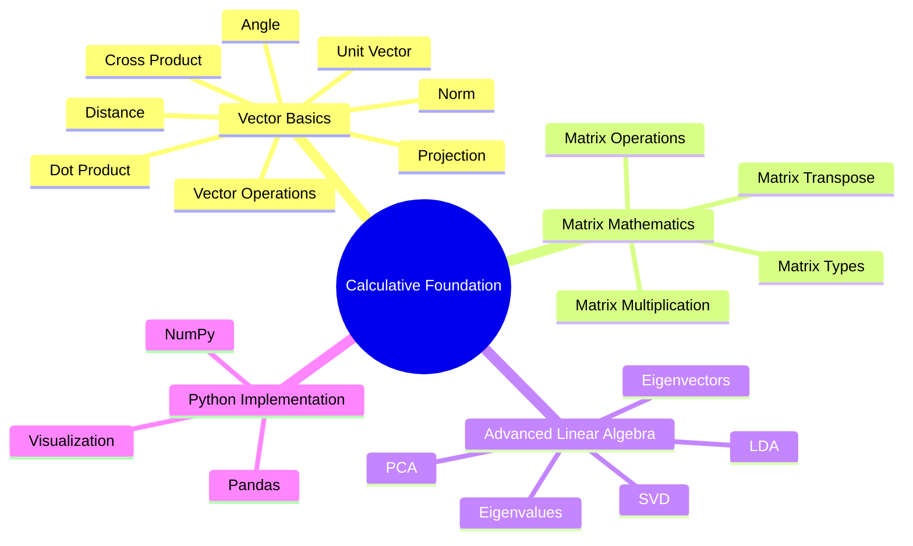
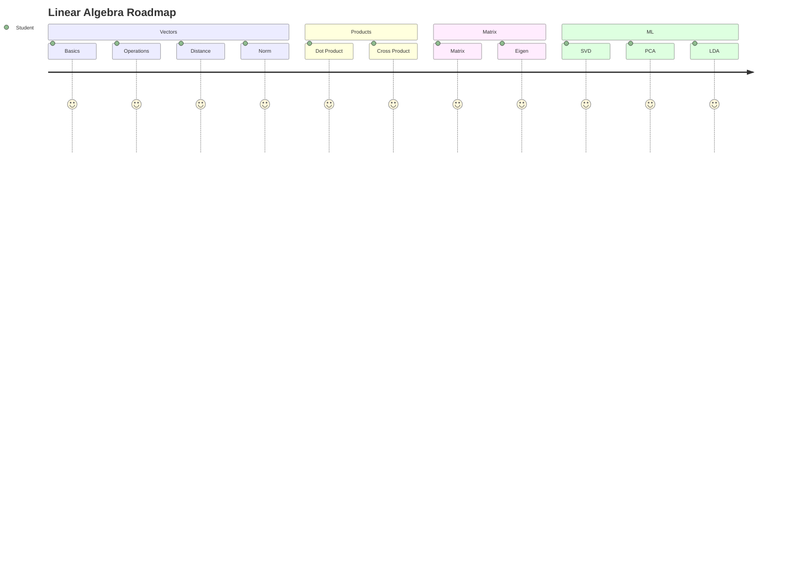

<div align="center">

# 📐 Calculative Foundation

### *Master Linear Algebra & Matrix Mathematics through Theory, Visualization, and Python Implementation*


<br>


<br><br>

> **A complete educational project that bridges Mathematical Theory with Practical Python Implementation.**

> Learn the foundations of **Linear Algebra**, understand the mathematics behind **Machine Learning**, and implement every concept using Python.

---

### 🚀 Quick Access

<a href="https://drive.google.com/file/d/1uw5a9HANxLyofMDP6BNYleWdTCh7qiE2/view?usp=sharing">

</a>

<a href="https://github.com/jeelprajapati0606/Calculative_foundation/blob/main/Calculative%20Foundation/Calculative_Foundation-checkpoint.ipynb">

</a>

<a href="https://github.com/jeelprajapati0606/Calculative_foundation/blob/main/Calculative%20Foundation/Project%20_%20Calculative%20Foundation(Theory)%20_-.pdf">

</a>

<a href="https://github.com/jeelprajapati0606/Calculative_foundation/blob/main/Calculative%20Foundation/Student_Performance_Dataset.csv">

</a>

</div>

---

# 🌟 Project Overview

Calculative Foundation is a complete learning project designed for students, beginners, and aspiring Data Scientists who want to understand the mathematical concepts behind Machine Learning.

Instead of only learning formulas, this project explains **why each concept matters**, demonstrates **real-world applications**, and provides **Python implementations** for every topic.

This project combines **Theory + Visualization + Coding + Practical Examples** into one structured repository.

---

# 🎯 Objectives

- 📚 Learn Linear Algebra from beginner to intermediate level
- 🧮 Understand mathematical intuition behind Machine Learning
- 🐍 Implement every concept using Python
- 📊 Visualize mathematical operations
- 💡 Apply concepts on a real-world student performance dataset
- 🚀 Build a portfolio-ready educational project

---

# ✨ Project Highlights

<table>

<tr>

<td align="center" width="33%">

## 📖 Theory

Comprehensive explanations with
definitions,
formulas,
examples,
applications,
and mathematical intuition.

</td>

<td align="center" width="33%">

## 💻 Practical

Hands-on Python implementation
using NumPy,
Pandas,
and Scikit-Learn.

</td>

<td align="center" width="33%">

## 📈 Visualization

Understand every concept visually
through graphs,
matrix operations,
and geometric interpretation.

</td>

</tr>

</table>

---

# 🚀 Key Features

| Feature | Status |
|----------|:------:|
| 📖 Complete Theory Notes | ✅ |
| 🧮 Linear Algebra Concepts | ✅ |
| 🐍 Python Implementation | ✅ |
| 📊 Real Dataset | ✅ |
| 📈 Mathematical Visualization | ✅ |
| 📚 Beginner Friendly | ✅ |
| 🎯 Step-by-Step Learning | ✅ |
| 💼 Portfolio Ready | ✅ |
| 📓 Jupyter Notebook | ✅ |

---

# 📚 Topics Covered

```text
Vectors
│
├── Vector Operations
├── Distance Between Vectors
├── Vector Norms
├── Unit Vector
├── Dot Product
├── Cross Product
├── Angle Between Vectors
├── Vector Projection
│
Matrices
│
├── Matrix Types
├── Matrix Operations
├── Matrix Multiplication
├── Matrix Transpose
│
Advanced Concepts
│
├── Eigenvalues
├── Eigenvectors
├── Singular Value Decomposition (SVD)
├── Principal Component Analysis (PCA)
└── Linear Discriminant Analysis (LDA)
```

---

# 📊 Project Statistics

| Category | Value |
|-----------|-------|
| 📚 Theory Chapters | 6 |
| 📖 Topics Covered | 15+ |
| 🐍 Python Implementations | 15+ |
| 📸 Output Visualizations | 20+ |
| 📊 Dataset | Student Performance |
| 📓 Notebook | Included |
| 🎥 Demo Video | Included |

---

# 🧠 Learning Roadmap



---

---

# 📂 Dataset

The practical implementation uses a **Student Performance Dataset** to demonstrate how Linear Algebra concepts are applied in real-world data analysis.

Rather than solving mathematical problems manually, the project performs calculations using Python and visualizes the results to build intuition.

---

## 📊 Dataset Overview

| Property | Details |
|:---------|:--------|
| 📄 Dataset Name | `Student_Performance_Dataset.csv` |
| 📂 File Format | CSV |
| 📈 Dataset Type | Structured Educational Dataset |
| 🎯 Domain | Student Performance Analysis |
| 💻 Programming Language | Python |
| 📚 Libraries Used | NumPy, Pandas, Matplotlib, Scikit-Learn |

---

## 📋 Dataset Features

| Column | Description |
|---------|-------------|
| Gender | Student Gender |
| Race / Ethnicity | Student Group |
| Parental Level of Education | Parent Education |
| Lunch | Lunch Category |
| Test Preparation Course | Preparation Status |
| Math Score | Mathematics Marks |
| Reading Score | Reading Marks |
| Writing Score | Writing Marks |

---

<div align="center">

## 📥 Download Dataset

<a href="https://github.com/jeelprajapati0606/Calculative_foundation/blob/main/Calculative%20Foundation/Student_Performance_Dataset.csv">

</a>

</div>

---

# 📖 Theory Concepts

Understanding Linear Algebra is the first step toward mastering Data Science, Artificial Intelligence, and Machine Learning.

Instead of memorizing formulas, this project focuses on **building intuition**, explaining **why each concept is important**, and demonstrating **how it is implemented in Python**.

---

<div align="center">

# 📚 Complete Theory Notes

### Click below to open the complete PDF.

<br>

<a href="https://github.com/jeelprajapati0606/Calculative_foundation/blob/main/Calculative%20Foundation/Project%20_%20Calculative%20Foundation(Theory)%20_-.pdf">


</a>

</div>

---

# 📘 Theory Roadmap


---

# 📚 Topics Included

| No. | Topic | What You'll Learn |
|:---:|--------|-------------------|
| 01 | 📌 Vectors | Representation, Magnitude & Direction |
| 02 | ➕ Vector Operations | Addition, Subtraction & Scalar Multiplication |
| 03 | 📏 Distance | Euclidean Distance Between Two Vectors |
| 04 | 📐 Norm | L1 & L2 Norm |
| 05 | 🎯 Unit Vector | Direction Without Magnitude |
| 06 | ⚫ Dot Product | Similarity Between Two Vectors |
| 07 | ✖ Cross Product | Perpendicular Vector |
| 08 | 📐 Angle Between Vectors | Relationship Between Directions |
| 09 | 📍 Projection | Projecting One Vector onto Another |
| 10 | 🧮 Matrix | Types & Operations |
| 11 | 📊 Eigenvalues | Matrix Transformation |
| 12 | 🧠 Eigenvectors | Principal Directions |
| 13 | 🔷 SVD | Matrix Decomposition |
| 14 | 📉 PCA | Dimensionality Reduction |
| 15 | 🎯 LDA | Feature Extraction & Classification |

---

# 💡 Learning Outcomes

After completing this project, you will be able to:

- ✅ Understand Linear Algebra intuitively
- ✅ Perform Vector Operations
- ✅ Calculate Distance & Norm
- ✅ Work with Dot & Cross Product
- ✅ Understand Matrix Mathematics
- ✅ Solve Eigenvalue Problems
- ✅ Understand SVD
- ✅ Perform PCA
- ✅ Apply LDA
- ✅ Implement every concept using Python

---

# 🌍 Real-World Applications

<table>

<tr>

<td width="25%" align="center">

## 🤖 Machine Learning

Feature Engineering

PCA

LDA

Neural Networks

</td>

<td width="25%" align="center">

## 📷 Computer Vision

Image Compression

Face Recognition

Object Detection

</td>

<td width="25%" align="center">

## 📊 Data Science

Data Analysis

Feature Reduction

Visualization

Prediction

</td>

<td width="25%" align="center">

## 🚀 Artificial Intelligence

Recommendation Systems

Optimization

Pattern Recognition

</td>

</tr>

</table>

---

# 🎯 Why Learn Linear Algebra?

<table>

<tr>

<td align="center" width="33%">

## 📈 Analyze Data

Understand relationships between variables and datasets.

</td>

<td align="center" width="33%">

## 🤖 Build ML Models

Almost every Machine Learning algorithm relies on Linear Algebra.

</td>

<td align="center" width="33%">

## 🚀 Improve Problem Solving

Develop mathematical thinking for AI and Data Science.

</td>

</tr>

</table>

---

# 📖 Concept Navigator

<details>

<summary>📌 Vectors</summary>

- Definition
- Formula
- Python Implementation
- Real-Life Example
- Visualization

</details>

<details>

<summary>📏 Distance & Norm</summary>

- Euclidean Distance
- Manhattan Distance
- L1 Norm
- L2 Norm
- Python Code

</details>

<details>

<summary>🎯 Dot & Cross Product</summary>

- Mathematical Formula
- Geometric Meaning
- Python Implementation
- Applications

</details>

<details>

<summary>🧮 Matrix Mathematics</summary>

- Matrix Types
- Matrix Operations
- Matrix Multiplication
- Transpose
- Identity Matrix

</details>

<details>

<summary>🧠 Eigenvalues & Eigenvectors</summary>

- Matrix Transformation
- Characteristic Equation
- Python Example
- Applications

</details>

<details>

<summary>🚀 SVD • PCA • LDA</summary>

- Dimensionality Reduction
- Feature Engineering
- Visualization
- Python Implementation

</details>

---

> 💡 **Tip:** The complete theory PDF contains detailed explanations, mathematical formulas, intuitive examples, and Python implementations for every topic covered in this repository.

---

---

# 💻 Practical Implementation

The practical section transforms mathematical concepts into real Python implementations using the **Student Performance Dataset**.

Each notebook section is carefully designed to help you understand **what the concept is**, **why it is important**, **how it works**, and **how it is implemented in Python**.

---


# 📖 Notebook Walkthrough

Every implementation follows the same structure.

- 🎯 Objective
- 📝 Explanation
- 🐍 Python Code
- 📸 Output Screenshot
- 💡 Observation

---

# 💻 Practical Implementation

The practical section demonstrates the implementation of Linear Algebra concepts using Python and the Student Performance Dataset. Each part contains multiple questions with their objectives, code, outputs, and observations.

---

# 📦 Initial Setup

## 📌 Import Required Libraries

### 🎯 Objective

Import all the required Python libraries for data manipulation, mathematical computation, visualization, and machine learning.

```python
# # Import libraries
import pandas as pd
import numpy as np
import statistics as stats
import math
import scipy
from scipy import linalg
from scipy.linalg import lu
import matplotlib.pyplot as plt
from mpl_toolkits.mplot3d import Axes3D
import seaborn as sns


```

> 💡 **Observation:** All required libraries were successfully imported.

---

## 📌 Load Student Performance Dataset

### 🎯 Objective

Load the dataset into a Pandas DataFrame and verify its contents.

```python
# data = pd.read_csv("Student_Performance_Dataset.csv")
data.head()
```

### 📸 Output


> 💡 **Observation:** Dataset loaded successfully and ready for further analysis.

---

# 📊 Part A — Vector Fundamentals

This section covers the basic concepts of vectors and their operations using student performance data.

---

## 🔹 Question 1 — Vector Representation & Operations

### 🎯 Objective

Represent student marks as vectors and perform basic vector operations such as addition, subtraction, and scalar multiplication.

```python
# # student 1 score vector
student_1 = data.loc[0, ['math_score', 'science_score', 'english_score']].to_numpy(dtype=float)


# student 2 score vector
student_2 = data.loc[1, ['math_score', 'science_score', 'english_score']].to_numpy(dtype=float)


# student 3 score vector
student_3 = data.loc[2, ['math_score', 'science_score', 'english_score']].to_numpy(dtype=float)


print("Student 1 : ",student_1)
print("Student 2 : ",student_2)
print("Student 3 : ",student_3)

```

### 📸 Output


> 💡 **Observation:** Student marks were successfully represented as vectors, and basic vector operations were performed.

---

## 🔹 Question 2 — Distance & Vector Norm

### 🎯 Objective

Calculate the Euclidean Distance, L1 Norm, and L2 Norm between vectors.

```python
# # L1 Norm
l1_student1 = np.linalg.norm(student_1, ord=1)
l1_student2 = np.linalg.norm(student_2, ord=1)
l1_student3 = np.linalg.norm(student_3, ord=1)


# L2 Norm
l2_student1 = np.linalg.norm(student_1)
l2_student2 = np.linalg.norm(student_2)
l2_student3 = np.linalg.norm(student_3)

print("Student:1 L1 norm: ",l1_student1)
print("Student:2 L1 norm: ",l1_student2)
print("Student:3 L1 norm: ",l1_student3)

print()

print("Student:1 L2 norm: ",l2_student1)
print("Student:2 L2 norm: ",l2_student2)
print("Student:3 L2 norm: ",l2_student3)


```

### 📸 Output


> 💡 **Observation:** The calculated norms represent vector magnitude, while Euclidean distance measures similarity between vectors.

---


## 🔹 Question 3 — Dot Product & Angle Between Vectors

### 🎯 Objective

Compute the dot product and determine the angle between two vectors.

```python
# dot_product = np.dot(student_1, student_2)

print("Dot Product = ",dot_product )

cos_theta = np.dot(student_1, student_2) / (
    np.linalg.norm(student_1) * np.linalg.norm(student_2)
)

angle = np.degrees(np.arccos(cos_theta))

print("\nAngle =",angle)
```

### 📸 Output


> 💡 **Observation:** The dot product measures vector similarity, while the angle represents their directional relationship.

---

## 🔹 Question 4 — Cross Product

### 🎯 Objective

Compute the cross product of two vectors and obtain the perpendicular vector.

```python
# cross_product = np.cross(student_1, student_2)

print("Cross Product = ",cross_product )
```

### 📸 Output


> 💡 **Observation:** The resulting vector is perpendicular to both input vectors.

---

## 🔹 Question 5 — Vector Projection

### 🎯 Objective

Project one vector onto another using vector projection.

```python
# projection = (np.dot(student_1, student_2) / np.dot(student_2, student_2)) * student_2

print("Projection of Student_1 on Student_2\n", projection)
```

### 📸 Output


> 💡 **Observation:** Vector projection indicates how much one vector lies in the direction of another vector.

---

# 🧮 Part B — Matrix Operations

This section focuses on representing data in matrix form and performing various matrix operations.

---

## 🔹 Question 1 — Matrix Representation & Operations

### 🎯 Objective

Create matrices from the dataset and perform matrix addition, multiplication, transpose, and other operations.

```python
# matrix_addition = matrix + matrix

print("Matrix Addition :\n", matrix_addition)

print()

matrix_multiplication = matrix.T @ matrix

print("Matrix Multiplication: \n", matrix_multiplication)
```

### 📸 Output


```python
transpose_matrix = matrix.T

print("Transpose_Matrix: \n", transpose_matrix)

print("\n Shape of Matrix:", matrix.shape)
```
### 📸 Output


```python
# Inverse:

cov_matrix = np.cov(matrix.T)
print("Covariance Matrix:\n ",cov_matrix )

# inverse matrix:

inverse_matrix = np.linalg.inv(cov_matrix)

print("\ninverse_matrix:\n", inverse_matrix)
```

### 📸 Output


```python
determinant = np.linalg.det(cov_matrix)

print("Determinant =", determinant)
```

### 📸 Output


> 💡 **Observation:** Matrix operations provide the mathematical foundation for many Machine Learning algorithms.

---

# 📈 Part C — Linear Transformations & Geometry :

---

## 🔹 Question 1 — Explain line, plane, and hyperplane with respect to your dataset dimensions


---

## 🔹 Question 2 — Show how dimensionality increases from 2D → 3D → higher dimensions with hyperplanes


```python
##  2D Visualization :

plt.figure(figsize=(7,5))

plt.scatter(data['math_score'], data['science_score'])

plt.xlabel("Math Score")
plt.ylabel("Science Score")
plt.title("2D Representation of Student Scores")

plt.grid(True)

plt.show()
```

### 📸 Output


---


```python
# 3D Visualization :

fig = plt.figure(figsize=(10,8))

ax = fig.add_subplot(111, projection='3d')

ax.scatter(
    data['math_score'],
    data['science_score'],
    data['english_score'],
    color='green'
)

ax.set_xlabel("Math Score")
ax.set_ylabel("Science Score")
ax.set_zlabel("English Score")

plt.title("3D Representation of Student Scores")

plt.show()
```

### 📸 Output


---

```python
# Hyperplane

# Create a new feature
data['average_score'] = data[
    ['math_score', 'science_score', 'english_score']
].mean(axis=1)

print("Features used:")
print(data[['math_score',
            'science_score',
            'english_score',
            'average_score']].head())

print("\nTotal Dimensions:", len(['math_score',
                                  'science_score',
                                  'english_score',
                                  'average_score']))
```

### 📸 Output


---
# 📈 Part D — Eigen Analysis

---

## 🔹 Question 1 — Eigenvalues & Eigenvectors

### 🎯 Objective

Compute Eigenvalues and Eigenvectors to understand matrix transformations.

```python
# 
# Eigenvalues and Eigenvectors of Covariance Matrix
eigen_values, eigen_vectors = np.linalg.eig(cov_matrix)

print("Eigenvalues:\n", eigen_values)


print("\nEigenvectors:\n", eigen_vectors)

```

### 📸 Output


> 💡 **Observation:** Eigenvectors represent principal directions, while Eigenvalues indicate the amount of variance along those directions.

---
## 🔹 Question 2 — Perform LU Decomposition of the dataset matrix 

```python
# 

# LU Decomposition
P, L, U = lu(cov_matrix)

print("Permutation Matrix (P):\n", P)

print("\nLower Triangular Matrix (L)\n:", L)


print("\nUpper Triangular Matrix (U):\n",U)

```

### 📸 Output


---
## 🔹 Question 3 — Singular Value Decomposition (SVD)

### 🎯 Objective

Perform Singular Value Decomposition for matrix factorization.

```python
# 
# Singular Value Decomposition
U, S, VT = np.linalg.svd(matrix)

print("U Matrix:\n", U)


print("\nSingular Values:\n", S)


print("\nV Transpose Matrix:\n", VT)

```

### 📸 Output


> 💡 **Observation:** SVD decomposes a matrix into three matrices, making dimensionality reduction and data compression possible.

---

# 📉 Part E — Dimensionality Reduction

---

## 🔹 Question 1 — Principal Component Analysis (PCA)

### 🎯 Objective

Reduce the dimensionality of the dataset while preserving maximum variance.

```python
# from sklearn.decomposition import PCA

X = data[['math_score', 'science_score', 'english_score']]

# Apply PCA
pca = PCA(n_components=2)

X_pca = pca.fit_transform(X)

print("First 5 PCA Components:\n", X_pca[:5])

```

### 📸 Output


> 💡 **Observation:** PCA successfully reduces dimensions while retaining most of the important information.

---

## 🔹 Question 2 — Linear Discriminant Analysis (LDA)

### 🎯 Objective

Perform Linear Discriminant Analysis to maximize class separability.

```python
# # Step 1: Create Categories


# Create target labels
data['Category'] = np.where(
    data['overall_score'] >= data['overall_score'].mean(),
    'Above Average',
    'Below Average'
)

print(data[['overall_score', 'Category']].head())

# Step 2: Encode Labels

from sklearn.preprocessing import LabelEncoder

encoder = LabelEncoder()

y = encoder.fit_transform(data['Category'])

# Step 3: Select Features

X = data[['math_score',
          'science_score',
          'english_score']]

# Step 4: Apply LDA

from sklearn.discriminant_analysis import LinearDiscriminantAnalysis

lda = LinearDiscriminantAnalysis(n_components=1)

X_lda = lda.fit_transform(X, y)

print("\nLDA Fit Transform:\n", X_lda[:10])

# Step 5 Visualize LDA

plt.figure(figsize=(8,5))

plt.scatter(
    X_lda,
    np.zeros(len(X_lda)),
    c=y,
    cmap='coolwarm',
    alpha=0.7
)

plt.xlabel("Linear Discriminant")
plt.title("LDA Classification of Students")

plt.yticks([])

plt.show()
```

### 📸 Output


> 💡 **Observation:** LDA improves class separation by finding the most discriminative feature combinations.

---


# 🛠️ Technologies Used

| Technology | Purpose |
|------------|---------|
| 🐍 Python | Programming Language |
| 🔢 NumPy | Linear Algebra Operations |
| 🐼 Pandas | Data Processing |
| 📊 Matplotlib | Visualization |
| 🤖 Scikit-Learn | PCA & LDA |
| 📓 Jupyter Notebook | Development Environment |

---

## 👤 Author

**Jeel Prajapati**

- GitHub: [@jeelprajapati0606](https://github.com/jeelprajapati0606)
- Repository: [Calculative Foundation]()

---
<div align="center">
   
###  ⭐ If you found this project helpful, please consider giving it a star! ⭐

### Made with ❤️ by Jeel Prajapati

</div>

---


